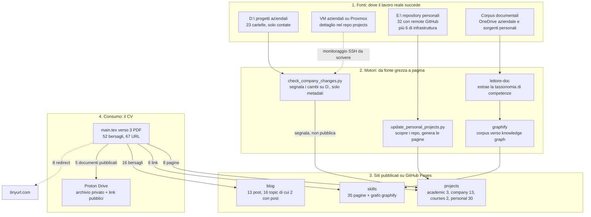

# Architettura dell'ecosistema personale

Come i progetti si aggiornano da soli e arrivano nel CV, in quattro bande: le fonti dove il lavoro reale succede, i motori che le trasformano in pagine, i siti pubblicati, e il consumo nel CV. Questo documento sostituisce `_notes/architecture-diagram.html`, che era la base ma viveva in una cartella ignorata da git.

## Due strati, due provenienze, e perché il confine è dichiarato

Questa scheda ha due metà che non si mantengono nello stesso modo, e tenerle distinte è l'unica ragione per cui resterà affidabile. Lo scheletro architetturale è scritto a mano ed è conoscenza editoriale: nessuno script potrà dedurre che un progetto su D: è un caso speciale, che il monitoraggio via SSH delle VM è pianificato e non scritto, o che una pubblicazione è stata deliberatamente scartata per motivi di anonimizzazione. Lo strato dei numeri e dello stato è generato da `tools/extract-ecosystem.py` dentro la regione marcata, e cambia a ogni modifica reale dell'ecosistema.

Il predecessore di questo documento dimostra a cosa serve la distinzione. `_notes/architecture-diagram.html`, scritto a mano il 2026-07-13, al controllo del 2026-09-04 portava quattro affermazioni false, tutte e quattro di tipo numerico o di stato: dichiarava `projects` non ancora collegato al CV mentre il CV ne linka otto pagine, dichiarava gli interessi non ancora collegati alle topic page mentre i tag collegati sono quindici, contava ventinove repository personali dove oggi ce ne sono trentotto con un remote, e diceva di vivere anche in un `ARCHITECTURE.md` che non esiste in nessuna cartella del progetto. La prosa architetturale dello stesso documento era invece rimasta corretta. Non è una coincidenza: la prosa descrive intenzioni, che cambiano di rado e con consapevolezza, mentre i numeri descrivono uno stato, che cambia da solo.

Da qui la regola operativa: nella regione generata non si scrive a mano, e fuori dalla regione non si scrivono numeri di stato. Se un numero serve nella prosa, va nel diagramma.

```powershell
python tools/extract-ecosystem.py --write
python tools/extract-ecosystem.py --check
```

## Il diagramma

<!-- BEGIN GENERATED ecosystem: ecosistema -->



<!-- END GENERATED ecosystem: ecosistema -->

## Banda 1, le fonti

Il lavoro reale succede in quattro posti con nature diverse. I progetti aziendali stanno su D:, sulla macchina del datore di lavoro, e su un gruppo di VM Linux ospitate da Proxmox. I progetti personali sono repository sotto E:, ciascuno con un remote GitHub. I corpus documentali, cioè il OneDrive aziendale e le sorgenti personali, alimentano la tassonomia delle competenze.

Divisione di responsabilità, decisa il 2026-09-04: il dettaglio dei progetti che vivono su D: appartiene al repository `projects`, perché sono progetti aziendali e quello è il sito che li descrive. Qui si contano le cartelle e non si legge né si trascrive alcun nome, dominio o indirizzo. Il vincolo non è di stile: l'analisi del 2026-07-13, poi riconfermata il 2026-07-14, ha stabilito che l'anonimizzazione a monte del progetto sorgente è insufficiente, perché il materiale contiene indirizzi privati reali, domini di fornitori e clienti e l'organizzazione GitHub aziendale nonostante si dichiari anonimizzato. La soluzione adottata là non è stata lo scrubbing del testo ma il conteggio di elementi grafici per categoria, senza mai leggere il testo dei singoli eventi, e lo stesso principio vale per questo documento.

## Banda 2, i motori

`update_personal_projects.py` in `projects` scopre i repository sotto E: interrogando l'API GitHub e genera le pagine per lingua; il suo limite noto è il rate limit dell'API, sessanta richieste all'ora senza token e due per progetto, che con questo numero di progetti si consuma quasi tutto in una corsa sola. `check_company_changes.py` segnala i cambiamenti su D: ma pubblica solo metadati: le voci aziendali restano scritte a mano dopo la segnalazione, mai pubblicate in automatico. Il monitoraggio delle VM Proxmox via SSH ha lo stesso ruolo del precedente ma non è ancora scritto, in attesa di credenziali. `lettore-doc` legge i corpus documentali ed estrae la tassonomia di competenze; `graphify` trasforma un corpus in knowledge graph, ed è ciò che produce il grafo interattivo pubblicato accanto alla tassonomia.

## Banda 3, i siti pubblicati

Tre repository indipendenti, ciascuno con il proprio deploy su GitHub Pages. Il blog ospita gli articoli e le topic page: un topic è un'area di interesse curata che riceve una descrizione editoriale sulla propria pagina anche prima che esista un articolo, per decisione registrata come ADR-018 in quel repository, quindi una topic page senza post non è una pagina vuota. Il navigator dei progetti pubblica le sezioni aziendale, personale, accademica e dei corsi, le prime due in parte auto-generate e le altre due scritte a mano. Il sito delle competenze pubblica la tassonomia e il grafo interattivo.

## Banda 4, il consumo, e i tre ruoli dell'archivio

Il CV resta un PDF stabile che non incorpora mai il dettaglio dei progetti o delle competenze: linka le pagine che si aggiornano da sole altrove. L'inventario completo di quei link, con numero di riga e sezione, sta in `external-links.md` e lo genera `tools/extract-cv-links.py`; le dipendenze verso i tre siti satellite e cosa le rompe stanno in `external-dependencies.md`.

Per i documenti di archivio che il CV cita, tre funzioni vanno tenute distinte, e confonderle è stata la causa di quasi tutta la confusione di settembre. La prima è l'archivio, cioè dove sta la raccolta completa. La seconda è la pubblicazione, cioè cosa può aprire uno sconosciuto che clicca un link: richiede una URL pubblica, e quindi una cartella locale non può servire, perché `attachments/` non ha una URL e nessuno al mondo può cliccarla. La terza è il backup, cioè una copia fuori sede.

L'assetto deciso il 2026-09-04, che amenda ADR-009 e vive in ADR-010: Proton Drive tiene la raccolta completa in cartelle private e genera link pubblici solo per il sottoinsieme che il CV e le pagine dei progetti citano, coprendo così archivio, pubblicazione e copia fuori sede; `attachments/` di questo repository resta la copia di lavoro locale, ignorata da git per ADR-003 perché non vanno file pesanti su GitHub; Google Drive esce dall'architettura, senza che nulla venga cancellato.

Vincolo da conoscere sulla verifica: un link Proton non si verifica con una richiesta HTTP, perché il percorso `/urls/<id>` risponde 200 a qualunque identificativo e la chiave di decifratura dopo il `#` non raggiunge mai il server. La verifica reale è aprire il link in una finestra privata, e la tabella di stato in `external-links.md` registra per ciascun link se è stata fatta e quando.

## Vincolo di portabilità

La banda delle fonti dipende da percorsi fissi di questa macchina Windows, cioè D: per i progetti aziendali ed E: per quelli personali, più il OneDrive aziendale il cui percorso contiene il nome dell'azienda e non viene riportato. Su un'altra macchina quei percorsi vanno riletti e non inventati: gli strumenti accettano `--e-root` e `--d-root` proprio per questo, e il secondo salto di `extract-cv-links.py` si disattiva da sé se la radice indicata non esiste.

## Altre fonti di verità sull'architettura, e il loro stato

Vale sapere che documenti di architettura ne esistono altri, ed è parte del motivo per cui è facile perdersi. `_notes/architecture-diagram.html` in questo repository è il predecessore di questa scheda: resta come riferimento storico ma è superato e non va aggiornato, perché i suoi numeri sono quelli del 2026-07-13. `E:\skills\architettura-pipelines.html` è un secondo diagramma, nel repository delle competenze, e descrive le pipeline di quel lato: non è stato verificato in questa sessione, quindi il suo stato è ignoto. Un `ARCHITECTURE.md`, citato dal diagramma di luglio come seconda sede dello stesso contenuto, non esiste in nessuna cartella del progetto.
