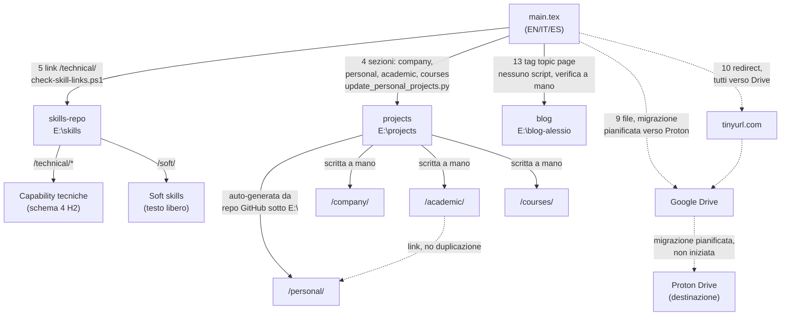

# Dipendenze esterne e flussi di sincronizzazione

`my-cv` non vive isolato: rimanda a tre siti satellite (skills-repo, projects, blog) e a Google
Drive per gli allegati. Questa scheda descrive, per ciascuna dipendenza, cosa la rompe e cosa
fare quando succede. Vedi `external-links.md` per l'inventario dei singoli link.

## Diagramma delle relazioni

Renderizzabile in qualunque visualizzatore Markdown con supporto Mermaid (GitHub, VS Code,
Obsidian). Le frecce continue sono i tre siti satellite mantenuti in prima persona (con lo
script/processo di verifica indicato sull'arco); le frecce tratteggiate sono risorse di terzi.

## skills-repo (`E:\skills`, `alesop95.github.io/skills/`)

**Cosa collega**: 5 Capability page tecniche sotto Esperienza lavorativa → Intrawelt, più il
link "Dettagli completi" della sezione Skills che punta alla home (ora indicizza sia le
Capability tecniche sotto `/technical/` sia la pagina `/soft/`).

**Cosa lo rompe**: la tassonomia non è congelata (dichiarato esplicitamente dall'utente il
2026-07-06) - pagine possono essere rinominate, spostate o rimosse. La ristrutturazione del
2026-07-14 (Capability sotto `/technical/`, nuova sezione `/soft/`) è un esempio reale di
rottura pianificata: ha richiesto aggiornare 5 link in `main.tex` in blocco.

**Come verificarlo**: `scripts/check-skill-links.ps1` (o `.sh`), da lanciare prima di ogni build
definitiva o dopo una modifica a skills-repo. Estrae ogni URL `alesop95.github.io/skills/...`
citato in `main.tex` e verifica con una HEAD request che risponda 2xx. Non fa parte della build
(non invocato da `build.ps1`), va lanciato a mano.

**Se skills-repo cambia struttura**: aggiornare i link in `main.tex`, poi ricontrollare con lo
script. Se si sposta un'intera Capability sotto un nuovo prefisso (come il passaggio a
`/technical/`), aggiornare anche `CLAUDE.md` di skills-repo, sezione "URL stabili del sito" -
quella tabella è la fonte di verità per gli URL pubblicati, va tenuta sincrona.

## projects (`E:\projects`, `alesop95.github.io/projects/`)

**Cosa collega**: 4 sotto-sezioni (`/company/`, `/personal/`, `/academic/`, `/courses/`), più il
link diretto a `harmony-book/` e alla pagina di documentazione infrastruttura in "Di cosa sono
fiero". `/company/` e `/personal/` sono in parte **auto-generate** da
`scripts/update_personal_projects.py` (scansiona i repository GitHub sotto `E:\`, aggiorna
`docs/personal/*.md` e l'indice categorizzato); `/academic/` e `/courses/` sono scritte a mano
(nessun repository dietro, contenuto derivato dal CV stesso).

**Cosa lo rompe**:
- un nuovo repository personale compare sotto `E:\` (o uno esistente cambia nome/organizzazione):
  va rilanciato lo script di aggiornamento, e se la nuova voce non è già in
  `PROJECT_CATEGORIES` (in cima allo script), va aggiunta a mano o finisce in una categoria
  "uncategorized" di fallback con un warning su stderr.
- il rate limit dell'API GitHub (60 richieste/ora senza token, 2 per progetto): con ~30 progetti
  scoperti lo script consuma quasi tutto il budget in una singola corsa, e una seconda corsa
  ravvicinata fallisce con `403 rate limit exceeded`. Soluzione immediata: aspettare il reset
  (circa un'ora) o passare `--token`/`GITHUB_TOKEN` per salire a 5000/ora.
- una pagina manuale (`docs/academic/*.md`, `docs/courses/*.md`) descrive contenuto che nel
  frattempo è cambiato nel repository/progetto reale a cui fa riferimento (es. la scoperta del
  2026-07-14 che la scheda di `civitanext` era rimasta ferma a "solo mockup di design" mentre il
  repository aveva già un'app Next.js/Prisma funzionante) - queste pagine non hanno alcun
  meccanismo di verifica automatica, vanno rilette a mano quando si tocca il progetto sottostante.

**Come verificarlo**: nessuno script di link-check dedicato (a differenza di skills-repo); la
verifica live si fa con una richiesta HTTP diretta all'URL (vedi il pattern usato in questa
sessione per confermare i deploy). `mkdocs build --strict` in locale (richiede un venv con
`mkdocs-material`, già presente in entrambe le cartelle) intercetta i link *interni* rotti prima
del push, non quelli verso GitHub/Drive esterni.

**Se un progetto personale cambia**: rilanciare `python scripts/update_personal_projects.py` da
`E:\projects` (rispettare il rate limit), poi verificare a occhio l'indice rigenerato. Se il
progetto ha già una pagina in `docs/academic/` o `docs/courses/` che lo descrive in un contesto
diverso (es. `harmonic-tension-vst3`, presente sia in `/personal/` sia referenziato da
`/academic/`), il contenuto vive in un solo posto (la pagina auto-generata) e l'altra vi fa solo
link, per non duplicare - controllare che il link non sia diventato uno slug diverso.

## blog (`E:\blog-alessio`, `alesop95.github.io/blog/`)

**Cosa collega**: 13 topic tag dalla sezione Interessi (via `\bloglinkwrap`), più la home
generica nell'header.

**Cosa lo rompe**: un tag citato nel CV (es. `musica`/`music`) può non avere ancora nessun post
associato - la pagina tag esiste comunque ed è raggiungibile (MkDocs/Next.js genera la pagina
anche vuota o con contenuto parzialmente pertinente), quindi il link "risulta" valido a un
controllo HTTP ma **non è detto che il contenuto sia pertinente**: verificato concretamente il
2026-07-15 per il tag "musica", che non conteneva alcun riferimento al progetto harmony-book
nonostante fosse il tag a cui l'interesse "Chitarra e teoria armonica" puntava.

**Come verificarlo**: nessuno script; per un controllo mirato, cercare nel sorgente
(`content/posts/<lingua>/*.mdx`, campo frontmatter `tags`) invece di fidarsi solo dello status
HTTP della pagina tag.

**Se un interesse non ha contenuto pertinente nel tag collegato**: due strade, scelte caso per
caso finora - aggiungere un riferimento reale in un post esistente pertinente (fatto per
harmony-book, poi scartato perché il progetto meritava un link diretto alla sua pagina invece
di una menzione di passaggio), oppure far linkare il titolo dell'interesse direttamente alla
risorsa primaria (pattern già usato per Stampa 3D, Bisogni Educativi Speciali, e ora
harmony-book), perdendo il rimando secondario al blog.

## Google Drive → Proton Drive (migrazione pianificata, non iniziata)

Analisi archiviata in `_notes/tbc-archive/da-sistemare/tech improvement/0. [TBC] Modifica
puntamento documenti anziché Google drive con Proton.docx`. Conclusione: **Proton Drive**, non
Nextcloud/Seafile (richiederebbero self-hosting) né MEGA (percezione "file hosting" poco
professionale in contesto enterprise). Proton Drive: piano gratuito 5 GB, E2EE reale, zero setup,
link con password e scadenza, buona percezione privacy/GDPR.

Struttura cartelle raccomandata (per contenuto, non per formato): `Certifications`, `Portfolio`,
`Projects`, `Publications`, `Thesis`, `References`. Condividere il singolo documento necessario,
mai la cartella radice.

**Checklist di migrazione** (9 link Google Drive attivi oggi, vedi `external-links.md` per
l'elenco con la cartella Proton proposta per ciascuno):

1. Creare un account Proton gratuito (include Mail/Calendar/Pass insieme a Drive, si usa solo Drive).
2. Creare le 6 cartelle sopra.
3. Per ciascuno dei 9 file/cartelle Drive elencati in `external-links.md`, caricare il documento
   nella cartella Proton corrispondente e generare un link di condivisione.
4. Aggiornare `main.tex` sostituendo il link Drive con quello Proton - per i link diretti; per i
   4 redirect tinyurl (`Tesi-magistrale`, `Tesi-trienn`, indirettamente anche il certificato
   "Hold Me Tight" e Sue Johnson se dietro redirect) basta aggiornare la destinazione del
   redirect, senza toccare `main.tex`.
5. Rilanciare `scripts/build.ps1` e ricontrollare il conteggio pagine (i link non incidono sulla
   lunghezza del testo visibile, ma verificare comunque che nessun overfull sia comparso).
6. Non cancellare i file da Google Drive finché la migrazione non è verificata end-to-end (link
   Proton raggiungibile, contenuto corretto) su tutti e 9 i documenti.

**Memo**: l'utente mantiene per ora una copia dei file anche su Google Drive durante la
migrazione (non li rimuove al momento del caricamento su Proton). Da cancellare da Google Drive
solo a migrazione completata su tutti i 9 file, come promemoria per la fine di questa fase.

Fase indipendente dal codice LaTeX: si può fare gradualmente, un link alla volta, senza bloccare
altro lavoro sul CV.

## ATS-safety e ottimizzazione per algoritmi di detection (rivalutazione richiesta il 2026-07-15)

Rimandata esplicitamente il 2026-07-06 come "non un'esigenza attiva", ora l'utente chiede di
riconsiderarla. Analisi originale archiviata in `_notes/tbc-archive/da-sistemare/tech
improvement/4. [TBC] - final - studio per scrivere CV non controllato dall'AI.docx` (titolo
fuorviante: il contenuto reale riguarda il parsing ATS, *Applicant Tracking System*, non un
controllo editoriale di un'IA).

**Problema**: i layout multi-colonna come quello di altaCV confondono l'ordine di lettura degli
ATS, che si basano sulla geometria di pagina più che sulla struttura logica; icone e badge
possono contaminare il layer testuale estratto (osservato concretamente in questa sessione: il
copia-incolla di "Di cosa sono fiero" produceva caratteri come "Z"/"¹"/"Ð" al posto delle icone
FontAwesome, esattamente il sintomo descritto nell'analisi).

**Raccomandazione di lungo periodo dell'analisi**: separare due rappresentazioni - un documento
ATS-safe (monocolonna, sequenza lineare, nessun elemento grafico, HTML semantico o Markdown come
sorgente) e il documento executive attuale per lettura umana, entrambi derivati da un'unica
fonte strutturata (YAML/Markdown/JSON) per evitare duplicazione. Non ancora costruita: nessuna
pipeline di questo tipo esiste oggi.

**Raccomandazione pragmatica di breve periodo (quella indicata come sufficiente se non c'è una
candidatura attiva tramite portale con parsing automatico)**: restare su altaCV, ma (1) verificare
che la colonna sinistra (principale) contenga tutte le informazioni critiche per il matching in
ordine cronologico lineare - già vero oggi: Esperienza lavorativa, Progetti, Corsi ed eventi
sono tutti in colonna sinistra; Istruzione è però in colonna destra, di norma un dato
rilevante per l'ATS, da valutare se spostare; (2) verificare col copia-incolla che il testo
estratto segua un ordine leggibile, non caotico; (3) rivedere il linguaggio delle descrizioni
verso terminologia standardizzata riconosciuta nel settore invece di formulazioni narrative.

**Non ancora deciso**: quale livello di intervento l'utente vuole ora - la sola verifica
pragmatica (bassa complessità, non tocca la struttura) o l'investimento nella pipeline
multi-output (alta complessità, richiede una fonte di contenuto separata da LaTeX). Da
concordare esplicitamente prima di agire, come per ogni altra decisione strutturale di questa
sessione.
