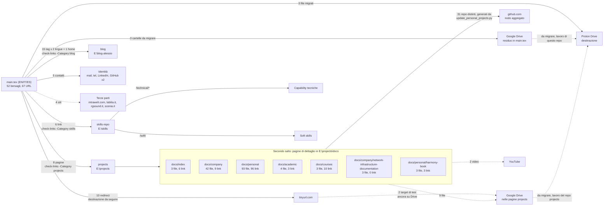

# Dipendenze esterne e flussi di sincronizzazione

`my-cv` non vive isolato: rimanda a tre siti satellite mantenuti in prima persona (skills-repo, projects, blog), a due servizi di archivio per gli allegati (Google Drive in uscita, Proton Drive in ingresso, migrazione parziale) e a un servizio di redirect. Questa scheda descrive, per ciascuna dipendenza, cosa la rompe e cosa fare quando succede; l'inventario dei singoli link, con numero di riga e sezione del CV, sta in `external-links.md` e lo genera `tools/extract-cv-links.py`.

## Diagramma delle relazioni

Renderizzabile in qualunque visualizzatore Markdown con supporto Mermaid (GitHub, VS Code, Obsidian). Le frecce continue sono le dipendenze mantenute in prima persona, con lo strumento di verifica indicato sull'arco; le frecce tratteggiate sono risorse di terzi o migrazioni ancora da fare. Il sottografo raccoglie il secondo salto, cioè le pagine di dettaglio del repository `projects` a cui il CV delega quattro sezioni intere.

Il blocco è generato da `tools/extract-cv-links.py` e non si modifica a mano: si rigenera con `python tools/extract-cv-links.py --write`, e la deriva rispetto al sorgente si rileva con `--check`. I numeri sugli archi vengono quindi dal sorgente, non dalla memoria di chi scrive, che è il motivo per cui la versione precedente di questo diagramma affermava che la migrazione verso Proton non era iniziata mentre tre file erano già migrati dal commit `7ea1955`.

<!-- BEGIN GENERATED cv-links: grafo -->

Gli asset di archivio nel perimetro raggiungibile sono 14: 3 già migrati su Proton Drive e 11 ancora su Google Drive, cioè 0 citati direttamente da `main.tex`, 9 nelle pagine di `projects` e 2 dietro i redirect di tesi. I tre insiemi sono disgiunti e si migrano in modi diversi: sostituzione nel sorgente, lavoro del repo `projects`, riconfigurazione del solo target del redirect.

<!-- END GENERATED cv-links: grafo -->

Cosa il grafo non mostra, e non per dimenticanza. La struttura interna di `skills-repo` oltre la biforcazione fra `/technical/` e `/soft/`, e quella delle sezioni di `projects` fra pagine auto-generate e scritte a mano, stanno nelle sezioni discorsive qui sotto: sono proprietà di quei repository, non archi di questo. I novanta link a `github.com` delle pagine `/personal/` valgono un nodo aggregato perché li genera `scripts/update_personal_projects.py` e non sono manutenzione manuale del CV; disegnarli tutti nasconderebbe il segnale utile, che sono i documenti di archivio ancora su Google Drive.

## skills-repo (`E:\skills`, `alesop95.github.io/skills/`)

**Cosa collega**: 5 Capability page tecniche sotto Esperienza lavorativa → Intrawelt, più il link "Dettagli completi" della sezione Skills che punta alla home (ora indicizza sia le Capability tecniche sotto `/technical/` sia la pagina `/soft/`).

**Cosa lo rompe**: la tassonomia non è congelata (dichiarato esplicitamente dall'utente il 2026-07-06) - pagine possono essere rinominate, spostate o rimosse. La ristrutturazione del 2026-07-14 (Capability sotto `/technical/`, nuova sezione `/soft/`) è un esempio reale di rottura pianificata: ha richiesto aggiornare 5 link in `main.tex` in blocco.

**Come verificarlo**: `powershell -NoProfile -File scripts/check-links.ps1 -Category skills` (o `bash scripts/check-links.sh --category skills`), da lanciare prima di ogni build definitiva o dopo una modifica a skills-repo. Verifica con una richiesta HEAD che ogni URL risponda 2xx, prendendo l'elenco dei link dal JSON di `tools/extract-cv-links.py` invece di rifare una propria regex, così esiste una sola definizione di cosa sia un link del CV. Non fa parte della build (non invocato da `build.ps1`), va lanciato a mano. `scripts/check-skill-links.ps1` e `.sh` restano come involucro su questa stessa categoria, per i riferimenti storici che li citano per nome.

**Se skills-repo cambia struttura**: aggiornare i link in `main.tex`, poi ricontrollare con lo script. Se si sposta un'intera Capability sotto un nuovo prefisso (come il passaggio a `/technical/`), aggiornare anche `CLAUDE.md` di skills-repo, sezione "URL stabili del sito" - quella tabella è la fonte di verità per gli URL pubblicati, va tenuta sincrona.

## projects (`E:\projects`, `alesop95.github.io/projects/`)

**Cosa collega**: 4 sotto-sezioni (`/company/`, `/personal/`, `/academic/`, `/courses/`), più il link diretto a `harmony-book/` e alla pagina di documentazione infrastruttura in "Di cosa sono fiero". `/company/` e `/personal/` sono in parte **auto-generate** da `scripts/update_personal_projects.py` (scansiona i repository GitHub sotto `E:\`, aggiorna `docs/personal/*.md` e l'indice categorizzato); `/academic/` e `/courses/` sono scritte a mano (nessun repository dietro, contenuto derivato dal CV stesso).

**Cosa lo rompe**:
- un nuovo repository personale compare sotto `E:\` (o uno esistente cambia nome/organizzazione): va rilanciato lo script di aggiornamento, e se la nuova voce non è già in `PROJECT_CATEGORIES` (in cima allo script), va aggiunta a mano o finisce in una categoria "uncategorized" di fallback con un warning su stderr.
- il rate limit dell'API GitHub (60 richieste/ora senza token, 2 per progetto): con ~30 progetti scoperti lo script consuma quasi tutto il budget in una singola corsa, e una seconda corsa ravvicinata fallisce con `403 rate limit exceeded`. Soluzione immediata: aspettare il reset (circa un'ora) o passare `--token`/`GITHUB_TOKEN` per salire a 5000/ora.
- una pagina manuale (`docs/academic/*.md`, `docs/courses/*.md`) descrive contenuto che nel frattempo è cambiato nel repository/progetto reale a cui fa riferimento (es. la scoperta del 2026-07-14 che la scheda di `civitanext` era rimasta ferma a "solo mockup di design" mentre il repository aveva già un'app Next.js/Prisma funzionante) - queste pagine non hanno alcun meccanismo di verifica automatica, vanno rilette a mano quando si tocca il progetto sottostante.

**Come verificarlo**: `powershell -NoProfile -File scripts/check-links.ps1 -Category projects` copre da settembre 2026 anche questa categoria, che fino ad allora non aveva alcuna verifica automatica. `mkdocs build --strict` in locale (richiede un venv con `mkdocs-material`, già presente in entrambe le cartelle) resta complementare: intercetta i link *interni* rotti prima del push, cioè quelli fra le pagine del sito, che una verifica HTTP sull'URL pubblicato non vede.

**Se un progetto personale cambia**: rilanciare `python scripts/update_personal_projects.py` da `E:\projects` (rispettare il rate limit), poi verificare a occhio l'indice rigenerato. Se il progetto ha già una pagina in `docs/academic/` o `docs/courses/` che lo descrive in un contesto diverso (es. `harmonic-tension-vst3`, presente sia in `/personal/` sia referenziato da `/academic/`), il contenuto vive in un solo posto (la pagina auto-generata) e l'altra vi fa solo link, per non duplicare - controllare che il link non sia diventato uno slug diverso.

## blog (`E:\blog-alessio`, `alesop95.github.io/blog/`)

**Cosa collega**: 13 topic tag dalla sezione Interessi (via `\bloglinkwrap`), più la home generica nell'header.

**Cosa lo rompe**: un tag citato nel CV (es. `musica`/`music`) può non avere ancora nessun post associato - la pagina tag esiste comunque ed è raggiungibile (MkDocs/Next.js genera la pagina anche vuota o con contenuto parzialmente pertinente), quindi il link "risulta" valido a un controllo HTTP ma **non è detto che il contenuto sia pertinente**: verificato concretamente il 2026-07-15 per il tag "musica", che non conteneva alcun riferimento al progetto harmony-book nonostante fosse il tag a cui l'interesse "Chitarra e teoria armonica" puntava.

**Come verificarlo**: `powershell -NoProfile -File scripts/check-links.ps1 -Category blog` verifica che le ventisei URL delle tredici topic page rispondano, italiano e inglese separatamente, ma la raggiungibilità non è la pertinenza: per quella serve cercare il tag nel sorgente del blog (`content/posts/<lingua>/*.mdx`, campo frontmatter `tags`) invece di fidarsi dello status HTTP della pagina, come dimostrato dal caso "musica" qui sopra.

**Se un interesse non ha contenuto pertinente nel tag collegato**: due strade, scelte caso per caso finora - aggiungere un riferimento reale in un post esistente pertinente (fatto per harmony-book, poi scartato perché il progetto meritava un link diretto alla sua pagina invece di una menzione di passaggio), oppure far linkare il titolo dell'interesse direttamente alla risorsa primaria (pattern già usato per Stampa 3D, Bisogni Educativi Speciali, e ora harmony-book), perdendo il rimando secondario al blog.

## Google Drive verso Proton Drive (nessun asset residuo nel CV)

Analisi archiviata in `_notes/tbc-archive/da-sistemare/tech improvement/0. [TBC] Modifica puntamento documenti anziché Google drive con Proton.docx`. Conclusione: **Proton Drive**, non Nextcloud/Seafile (richiederebbero self-hosting) né MEGA (percezione "file hosting" poco professionale in contesto enterprise). Proton Drive: piano gratuito 5 GB, E2EE reale, zero setup, link con password e scadenza, buona percezione privacy/GDPR.

Struttura cartelle raccomandata (per contenuto, non per formato): `Certifications`, `Portfolio`, `Projects`, `Publications`, `Thesis`, `References`. Condividere il singolo documento necessario, mai la cartella radice.

**Stato al 2026-09-04**: `main.tex` non cita più alcun link a Google Drive. I tre che citava sono usciti il 2026-09-03 senza passare da Proton, due verso le topic page del blog e uno verso la pagina di progetto di `spanish-learning`: il dettaglio, e il precedente che ne deriva, stanno in `external-links.md`. Restano nel perimetro raggiungibile undici asset Drive, cioè i nove nelle pagine del repository `projects` e i due dietro i redirect di tesi, questi ultimi in corso di spostamento su Proton in `Thesis` con sostituzione diretta in `main.tex` e ritiro dei due redirect.

**Stato precedente, al 2026-09-03**: 3 file migrati (i tre link Proton della sezione Istruzione, dal commit `7ea1955`), 14 ancora su Google Drive. Il residuo non è un unico elenco ma tre insiemi disgiunti, che si migrano in modi diversi e appartengono a repository diversi: 3 link citati direttamente da `main.tex`, che si sostituiscono nel sorgente; 2 target dei redirect di tesi, che si riconfigurano sul pannello tinyurl senza toccare `main.tex`; 9 file nelle pagine del repository `projects`, che sono lavoro di quel repository. L'elenco riga per riga, con la cartella Proton di destinazione, sta in `external-links.md`. La versione precedente di questa scheda ne contava 9 in un solo insieme, mescolando i due perimetri.

**Procedura per un file del primo insieme**: caricare su Proton nella cartella indicata, condividere con "Share with anyone" e permesso "Can view", sostituire l'argomento di `\href` in `main.tex` scappando il carattere `#` del frammento come `\#`, rigenerare l'inventario con `python tools/extract-cv-links.py --write`, poi `powershell -NoProfile -File scripts/build.ps1` e verificare che tutte e tre le lingue restino su una pagina sola. I link non incidono sulla lunghezza del testo visibile, ma la verifica del conteggio pagine resta dovuta perché il documento è al limite.

**Memo**: durante la migrazione i file restano anche su Google Drive, e si cancellano da là solo a migrazione verificata end-to-end su tutti i documenti, cioè link Proton raggiungibile e contenuto corretto. Fase indipendente dal codice LaTeX: si può fare gradualmente, un file alla volta, senza bloccare altro lavoro sul CV.

## ATS-safety e ottimizzazione per algoritmi di detection (rivalutazione richiesta il 2026-07-15)

Rimandata esplicitamente il 2026-07-06 come "non un'esigenza attiva", ora l'utente chiede di riconsiderarla. Analisi originale archiviata in `_notes/tbc-archive/da-sistemare/tech improvement/4. [TBC] - final - studio per scrivere CV non controllato dall'AI.docx` (titolo fuorviante: il contenuto reale riguarda il parsing ATS, *Applicant Tracking System*, non un controllo editoriale di un'IA).

**Problema**: i layout multi-colonna come quello di altaCV confondono l'ordine di lettura degli ATS, che si basano sulla geometria di pagina più che sulla struttura logica; icone e badge possono contaminare il layer testuale estratto (osservato concretamente in questa sessione: il copia-incolla di "Di cosa sono fiero" produceva caratteri come "Z"/"¹"/"Ð" al posto delle icone FontAwesome, esattamente il sintomo descritto nell'analisi).

**Raccomandazione di lungo periodo dell'analisi**: separare due rappresentazioni - un documento ATS-safe (monocolonna, sequenza lineare, nessun elemento grafico, HTML semantico o Markdown come sorgente) e il documento executive attuale per lettura umana, entrambi derivati da un'unica fonte strutturata (YAML/Markdown/JSON) per evitare duplicazione. Non ancora costruita: nessuna pipeline di questo tipo esiste oggi.

**Raccomandazione pragmatica di breve periodo (quella indicata come sufficiente se non c'è una candidatura attiva tramite portale con parsing automatico)**: restare su altaCV, ma (1) verificare che la colonna sinistra (principale) contenga tutte le informazioni critiche per il matching in ordine cronologico lineare - già vero oggi: Esperienza lavorativa, Progetti, Corsi ed eventi sono tutti in colonna sinistra; Istruzione è però in colonna destra, di norma un dato rilevante per l'ATS, da valutare se spostare; (2) verificare col copia-incolla che il testo estratto segua un ordine leggibile, non caotico; (3) rivedere il linguaggio delle descrizioni verso terminologia standardizzata riconosciuta nel settore invece di formulazioni narrative.

**Non ancora deciso**: quale livello di intervento l'utente vuole ora - la sola verifica pragmatica (bassa complessità, non tocca la struttura) o l'investimento nella pipeline multi-output (alta complessità, richiede una fonte di contenuto separata da LaTeX). Da concordare esplicitamente prima di agire, come per ogni altra decisione strutturale di questa sessione.
